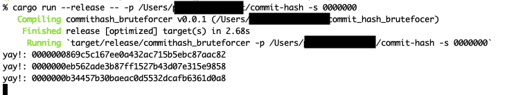

# git commit hash bruteforcer

任意のコミットハッシュを作り出すべくgitのコミットハッシュを総当たりするツール
[こういうこと](https://github.com/rnitta/awesome-commit-hash/pull/2)ができる

## 環境
- mac
- git 1.9+
- rust 1.35


## 使い方

ビルドもする場合:

```shell
$ cargo run --release -- -p <path/to/git/repository> -s <prefix> 
```

`<prefix>` は `1234567`や `0000`等任意の `[0-9a-f]{1,40}`の文字列

> 

## 性能
`3.5 GHz Intel Core i7`で7桁指定すると5~10分に1度コミットされた

## todo
- 時間指定できるように
- 並列化
- ちゃんとしたベンチ
